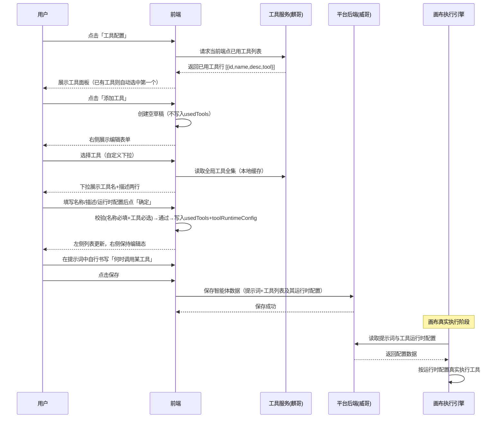
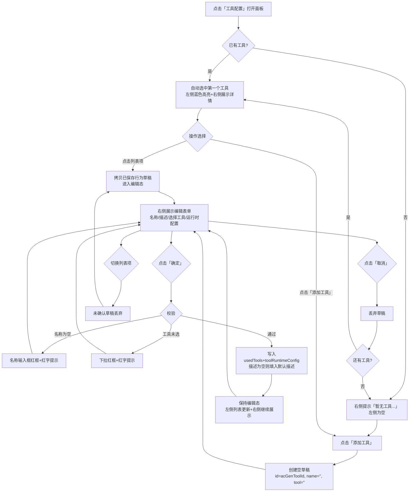
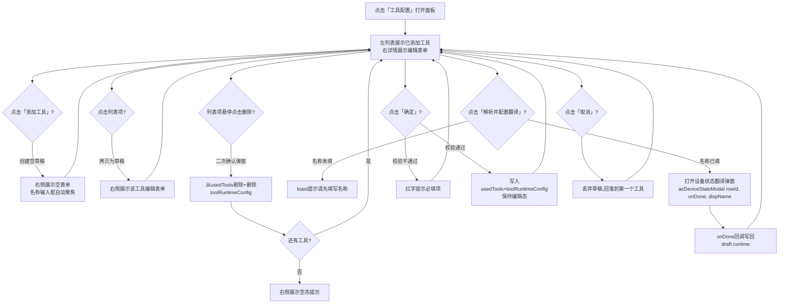

# AIOT 工具（Tool）流程图

描述用户在提示词编辑场景下，通过草稿编辑态管理工具配置的完整流程。**工具面板与提示词不做联动**：加入/移除工具都不改动提示词，用户需在提示词中自行写明何时调用工具，且**调用的工具范围必须落在当前端点可用工具列表内**。

> 职责分工：
> - **工具服务（麒哥）**：提供全局工具全集，以及当前端点「已用工具」列表（工具列表初始来源）。
> - **平台后端（威哥）**：负责智能体数据（含提示词 + 工具列表及运行时配置）的存储；画布真实执行时也从平台后端取数。

---

## 主流程泳道图

---

## 草稿编辑态流程

---

## 面板内交互流程

---

## 关键说明

- **草稿编辑态**：所有编辑操作先写入 `draft` 对象，点「确定」经校验后才提交到 `AC.usedTools`；未确定即切走则草稿丢弃。
- **数据模型**：`AC.usedTools` 为对象数组 `[{id, name, desc, tool}]`，行 id 由 `acGenToolId()` 生成；`AC.toolRuntimeConfig` 和 `AC.deviceStateDraft` 均以行 id 为键。
- **入口位置**：「工具配置」位于提示词编辑区「任务规划器」行右侧、「编写教程」左侧，纯文字无图标。
- **初始态**：打开面板自动选中第一个工具（蓝色高亮+右侧详情）；无工具时右侧展示空态提示，左侧为空。
- **确定后保持编辑态**：提交成功后 draft 不置空，右侧继续展示当前工具内容，左侧列表同步更新。
- **描述自动填充**：点确定时若描述为空，自动写入所选工具的默认描述。
- **内联校验**：名称/工具未填时字段下方红字提示+红框，输入/选择后自动清除。
- **删除回落**：删除后右侧回落到列表第一个工具（无工具则空态提示）。
- **取消回落**：取消后回落到列表第一个工具（无工具则空态提示）。
- **工具与提示词不联动**：加入/移除工具都**不改动提示词**；用户需在提示词中写明**何时用什么工具**，且所写工具**必须落在当前端点可用工具列表内**。
- **运行时配置**：始终展示（无论是否已选择工具），点击「解析并配置翻译」进入设备状态翻译弹窗（回调式写回）。
- **数据存储与取数**：智能体数据（提示词 + 工具列表及运行时配置）统一存储在**平台后端（威哥）**；画布真实执行时从**平台后端（威哥）**读取。