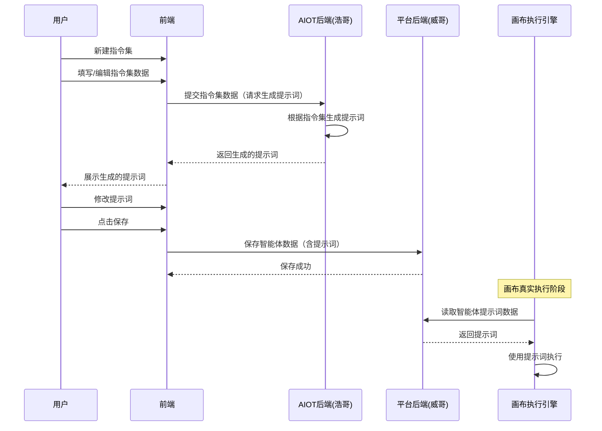
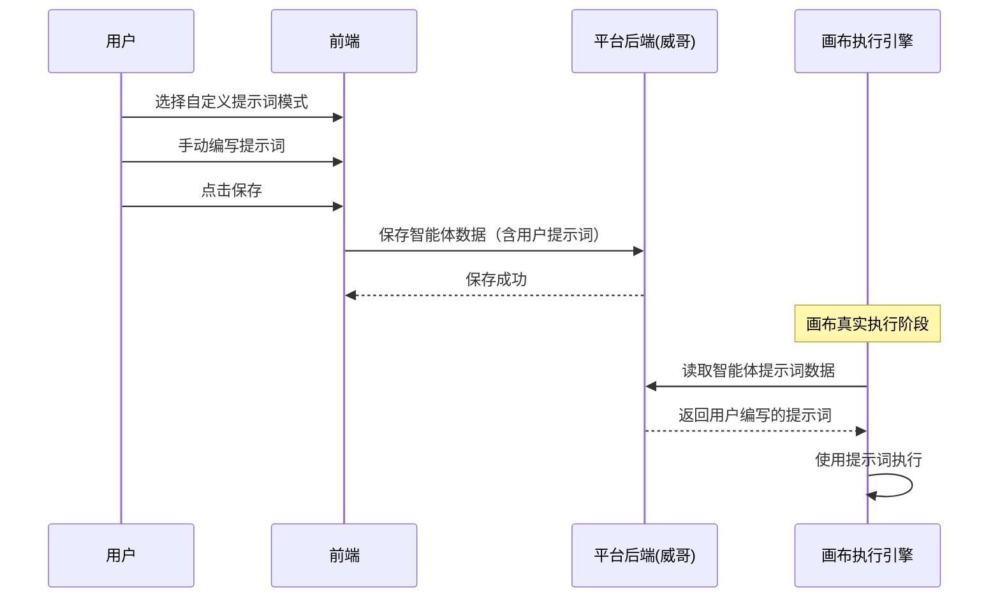
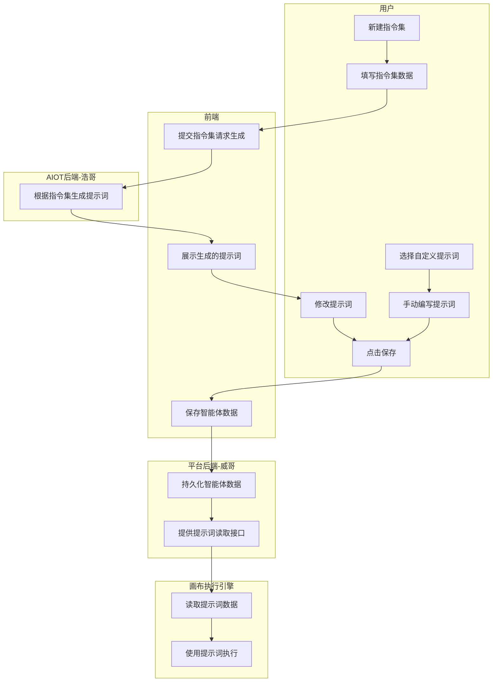

# AIOT 自定义提示词泳道图

AIOT 支持自定义提示词的两条链路，使用泳道图（sequenceDiagram）方式呈现，便于评审时开发理解各自职责。

> 职责分工：
> - **AIOT后端（浩哥）**：负责根据指令集生成提示词。
> - **平台后端（威哥）**：负责智能体数据的存储；画布真实执行时也从平台后端取数。

---

## 链路一：指令集生成提示词（AI 辅助生成）

用户新建指令集 → 指令集数据传给 AIOT 后端（浩哥）生成提示词 → 提示词返回前端展示 → 用户修改提示词 → 保存智能体数据到平台后端（威哥） → 画布真实执行时从平台后端取提示词数据执行。

---

## 链路二：用户自定义提示词（手动编写）

用户选择自定义提示词 → 保存智能体数据到平台后端（威哥） → 画布真实执行时从平台后端取用户写的提示词执行。

---

## 两条链路整体对比（泳道汇总）

## 关键说明

- 链路一：提示词由 **AIOT后端（浩哥）** 基于指令集数据生成，用户可在前端二次编辑后保存到 **平台后端（威哥）**。
- 链路二：提示词完全由用户手动编写，AIOT后端不参与生成，直接保存到 **平台后端（威哥）**。
- 两条链路的共同终点：画布真实执行时，均从 **平台后端（威哥）** 读取已保存的提示词数据进行执行。