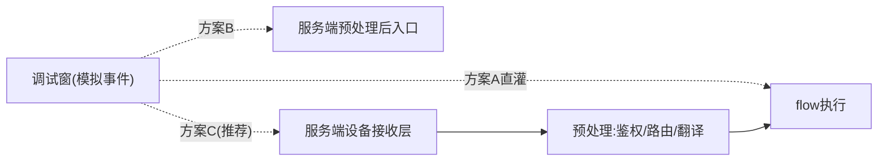

# 调试窗「模拟端侧事件上报」接口对接需求文档

> 面向对象：服务端（威哥）
> 目标：为平台调试窗新增「模拟端侧事件上报」能力，与现有「模拟用户 query」并列。本文档明确前端诉求、需要服务端提供的接口契约、以及待对齐事项。

## 一、背景与问题

平台配置的是智能体 flow，调试窗当前只能测试 flow 内的功能，且**只支持模拟用户 query**。但真实运行时，用户 query 与设备端事件上报都需先经过服务端预处理（鉴权、路由、状态翻译等）再进入 flow。

调试阶段没有真实硬件设备，无法产生真实的端侧事件上报，导致「设备事件 → 服务端 → flow」这条链路无法被调试验证。因此需要服务端提供一个「调试注入通道」，让调试窗能把一条**模拟的端侧事件**灌入执行链路。

真实链路：


调试诉求：在没有真实设备的前提下，从链路的某一层「直接灌入」一条模拟事件。

## 二、注入位置方案（需服务端确认采用哪种）

「灌在链路哪一层」决定调试保真度，请服务端评估可行性与成本：

| 方案 | 注入位置 | 保真度 | 说明 |
| --- | --- | --- | --- |
| A | 跳过服务端，前端直调 flow 触发入口 | 低 | 测不到鉴权/路由/状态翻译；前端可自行实现，作兜底 |
| B | 服务端预处理**之后**、进 flow 前的入口 | 中 | 服务端提供一个内部注入接口 |
| C（推荐） | 服务端设备**接收层**（模拟设备上报） | 高 | 从「服务端收到设备事件」那一刻开始走完整链路，可验证鉴权、路由、状态翻译 templateRender |



**前端倾向方案 C**：最贴近真实上报，能顺带验证设备状态翻译（`postHandler: templateRender`）是否生效。若成本过高，至少支持方案 B，并在调试窗明确标注「本模拟未覆盖服务端接收层」。

## 三、需要服务端提供的接口

### 1. 提交模拟事件上报

| 项 | 内容 |
| --- | --- |
| 用途 | 调试窗提交一条模拟端侧事件，触发一次链路执行 |
| 请求方式 | 待定（建议 POST，或复用现有调试通道） |
| 环境标识 | 需携带「调试/模拟」标记，避免污染真实设备与生产数据 |

**请求体（建议字段，待对齐）**：

```json
{
  "debug": true,
  "sessionId": "调试会话ID，与同会话的模拟query共享上下文",
  "deviceId": "设备ID（可为调试专用/真实）",
  "token": "设备token（是否必须真实待定）",
  "eventType": "状态上报 | 按键 | 唤醒 | 传感器 | ...",
  "payload": { "上行事件JSON，与真实端侧上报格式完全一致": "..." },
  "timestamp": 1785334704485,
  "traceId": "用于全链路追踪"
}
```

**响应体（建议）**：

```json
{
  "success": true,
  "traceId": "回传，用于关联执行结果",
  "data": {
    "flowTriggered": true,
    "preprocessResult": "服务端预处理后的结果（如翻译后的自然语言文本）",
    "flowResult": "flow执行结果 / 模型输入"
  }
}
```

### 2.（可选）执行链路 trace 查询

用于调试窗展示「事件 → 服务端预处理 → flow 执行 → 模型输入」的完整过程，便于定位问题。若服务端已有 trace 能力，请提供按 `traceId` 查询的接口。

## 四、待对齐事项（关键）

1. **是否已有可复用的调试接口**？没有的话是否愿意新增，采用二、中哪个方案？
2. **上报报文契约**：设备端事件上报的真实报文结构是什么？`eventType` 枚举有哪些？`payload` 结构规范？前端需与真实格式**完全对齐**。
3. **身份要求**：是否要求真实 `token`/`deviceId`？能否支持「调试专用模拟身份」，避免依赖真实设备。
4. **环境隔离**：模拟事件是否会写入真实设备状态/历史？如何打「调试标记」隔离，避免污染生产数据。
5. **上下文共享**：模拟事件与同会话的模拟 query 是否共享 `sessionId` 上下文（支持穿插调试）？
6. **状态翻译衔接**：模拟事件应能触发工具运行时配置中的状态翻译（`templateRender`），并回传渲染后的文本供调试窗展示。
7. **异常与降级**：无效 deviceId/token、payload 缺字段、超大报文、事件与当前 flow 不匹配等场景，服务端返回的错误码与提示约定。

## 五、前端侧配套（供服务端了解，不需服务端实现）

- 调试窗新增「模拟事件上报」输入区，与「模拟用户 query」并列，支持事件类型选择 + payload JSON 编辑；
- 事件模板库 / 历史记录 / 一键回填；JSON 校验复用现有校验逻辑；
- 与设备草稿（`deviceId`/`token`）打通，可直接拉取真实上行状态作为 payload 参考；
- 展示服务端回传的 trace，呈现完整执行过程。

## 六、交互原型

见同目录 `调试窗模拟端侧事件上报-交互原型.html`（静态原型，纯演示交互，不含真实接口调用）。